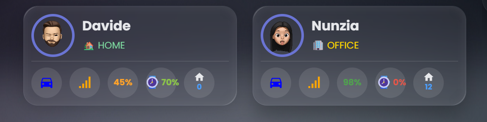
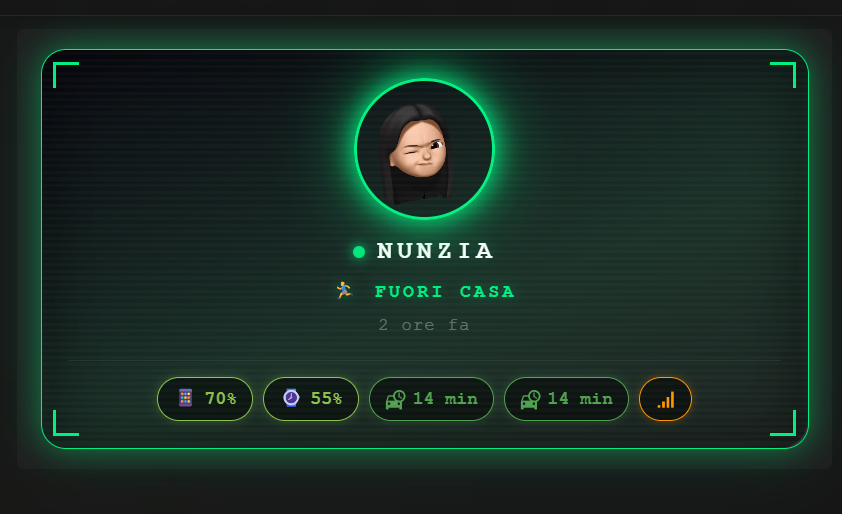
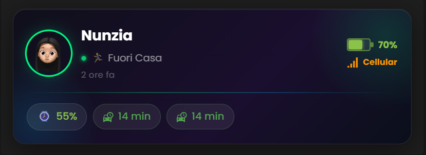
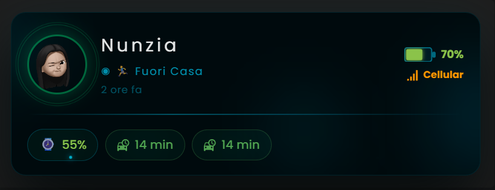
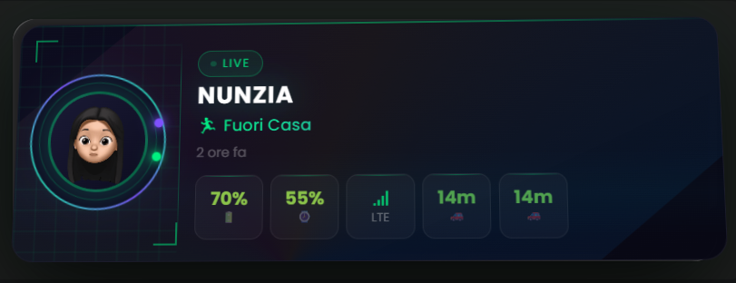
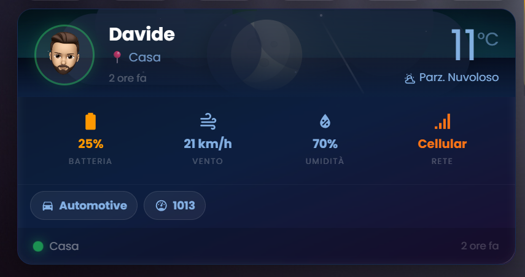
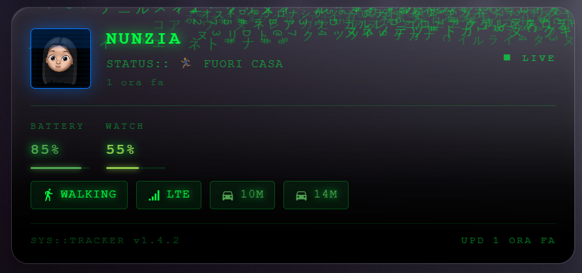
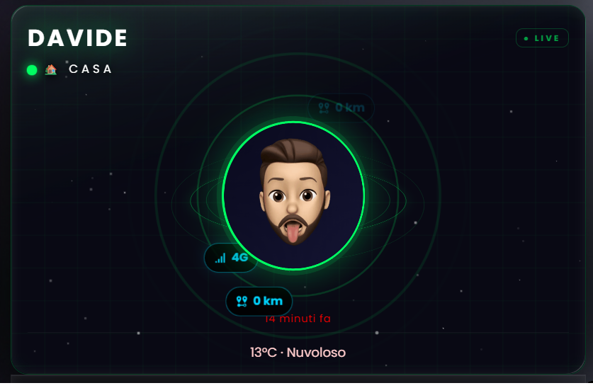

# 👤 Person Tracker Card for Home Assistant

[](https://github.com/custom-components/hacs)
[](https://github.com/djdevil/person-tracker-card)
[](https://www.buymeacoffee.com/divil17f)

Advanced card for Home Assistant that displays detailed information about people with complete visual editor and **ten layout modes**.

---

### 📐 Classic


---

### 📦 Compact


---

### ✨ Modern


---

### ✦ Neon


---

### ◈ Glass


---

### ◉ Bioluminescence


---

### ◈ Holographic 3D


---

### 🌦️ Weather Station


---

### 🖥️ Matrix Rain


---

### 🪐 Orbital


---

**[🇬🇧 English](#english-version) | [🇮🇹 Versione Italiana](#versione-italiana)**

---

[](https://my.home-assistant.io/redirect/hacs_repository/?owner=djdevil&repository=person-tracker-card&category=plugin)  [](https://www.buymeacoffee.com/divil17f)

<a name="english-version"></a>
## 📑 Table of Contents

- [✨ Key Features](#-key-features)
- [🎨 Layout Modes](#-layout-modes)
- [🌦️ Weather Animations](#️-weather-animations)
- [📦 Installation](#-installation)
- [🔧 Configuration](#-configuration)
- [📱 Mobile App Integration](#-mobile-app-integration)
- [🗺️ Smart Travel Mode](#️-smart-travel-mode)
- [🎭 Examples](#-examples)
- [🎬 Animated Emoji Avatar](#-animated-emoji-avatar-memoji--ar-emoji)
- [🔍 Troubleshooting](#-troubleshooting)
- [📝 Changelog](#-changelog)

---

## ✨ Key Features

- 🎨 **Ten Layout Modes** — Classic, Compact, Modern, Neon, Glass, Bioluminescence, Holographic 3D, Weather Station, Matrix Rain, Orbital
- 🪐 **Geocoded Location** — Shows reverse-geocoded street address when away from home
- 🌦️ **Rich Weather Animations** — 15 fully animated weather states as card background
- 📱 **Auto Sensor Detection** — Automatically finds battery, activity, connection sensors from the HA Companion App
- 🔋 **Battery Monitoring** — Phone battery with dynamic icon and color
- ⌚ **Watch Battery** — Apple Watch and smartwatch support
- 🚶 **Activity Tracking** — Walking, Running, Automotive, Stationary, Cycling
- 📍 **Distance from Home** — Waze / Google Routes integration
- ⏱️ **Smart Travel Mode** — Two-direction sensor system (home↔work)
- 📶 **Connection Type** — WiFi or mobile network indicator
- 🎨 **Customizable States** — Different colors and images for each location
- 🖼️ **Custom Images** — PNG/GIF with transparency support
- 🎯 **Complete Visual Editor** — User-friendly GUI configuration in 4 languages
- 🌍 **Multilanguage** — Italian, English, French, German

---

## 🎨 Layout Modes

### Classic
Full-size card with freely positionable elements. Ideal for large dashboard cards.

```yaml
type: custom:person-tracker-card
entity: person.davide
layout: classic
aspect_ratio: '1/0.7'
picture_size: 60
battery_position: top-right
activity_position: bottom-left
```

### Compact
Horizontal grid layout with fixed structure. Perfect for tracking multiple people side by side.

```yaml
type: custom:person-tracker-card
entity: person.davide
layout: compact
compact_width: 300
```

### Modern
Sleek horizontal card with SVG circular progress rings for battery, distance, and travel time.

```yaml
type: custom:person-tracker-card
entity: person.davide
layout: modern
modern_picture_size: 45
modern_name_font_size: '16px'
modern_state_font_size: '13px'
```

### Neon ✦
Dark cyberpunk theme with glowing neon badges, monospace font, and scanline overlay.

```yaml
type: custom:person-tracker-card
entity: person.davide
layout: neon
```

### Glass ◈
Frosted glassmorphism card with translucent chips, gradient orbs, and animated status dot. Accent color adapts to the person's state.

```yaml
type: custom:person-tracker-card
entity: person.davide
layout: glass
```

### Bioluminescence ◉
Deep-ocean theme with animated glowing orbs, rising particles, double pulsing avatar ring, SVG battery fill, and weather footer bar.

```yaml
type: custom:person-tracker-card
entity: person.davide
layout: bio
```

### Holographic 3D ◈
Futuristic card with real CSS 3D perspective — the card floats and tilts continuously in 3D space. Features rotating rings + orbital dots around the avatar, iridescent conic-gradient shimmer, animated scan bar, corner tech decorations, and metric chips. Hover flattens to front view.

```yaml
type: custom:person-tracker-card
entity: person.davide
layout: holo
```

### Weather Station 🌦️
A dedicated dashboard for personal weather data. Weather animation fills the top section, with a dynamic 4-column gauge grid (battery, watch, wind, humidity, pressure, feels like — priority order). Overflow sensors appear as chips below the grid. Travel and distance chips animate at the bottom.

```yaml
type: custom:person-tracker-card
entity: person.davide
layout: wxstation
weather_entity: weather.home
show_weather: true
```

### Matrix Rain 🖥️
Terminal/hacker theme with animated falling katakana and hexadecimal characters as background. Square avatar with CRT scanlines and animated scan bar. Monospace stats blocks with phosphor green progress bars. Avatar border and scan bar color follow the state color picker.

```yaml
type: custom:person-tracker-card
entity: person.davide
layout: matrix
```

### Orbital 🪐
Sci-fi space theme with a spinning 3D coin (front = photo, back = battery levels of all devices), three tilted orbital rings, up to four orbiting satellite badges (connection, activity, distance/travel time), animated pulse rings, twinkling stars, and a perspective grid overlay. Accent color adapts to state: teal when home, violet when not home, blue for custom zones.

```yaml
type: custom:person-tracker-card
entity: person.davide
layout: orbital
show_weather: true
weather_entity: weather.home
show_geocoded_location: true
```

---

## 🌦️ Weather Animations

Enable animated weather backgrounds by providing a `weather` entity:

```yaml
type: custom:person-tracker-card
entity: person.davide
layout: modern          # works on all 10 layouts
weather_entity: weather.home
show_weather: true
show_weather_background: true   # animated scene
show_weather_temperature: true  # temperature label
```

### Supported Weather States

| State | Animation |
|-------|-----------|
| ☀️ `sunny` | Glowing sun with 18 rotating rays and pulsing halo |
| 🌙 `clear-night` | Moon with craters, aurora ribbons, stars, falling meteor |
| ⛅ `partlycloudy` | Day: sun + clouds · Night: moon + stars + clouds |
| ☁️ `cloudy` | 5 animated grey clouds at different depths |
| 🌫️ `fog` | 8 drifting blur bands layered for depth |
| 💨 `windy` / `windy-variant` | 10 wind sweep lines with fading gradient |
| 🌧️ `rainy` | Dark clouds + 26 rain drops with splash animations |
| 🌨️ `snowy-rainy` | Dark clouds + mixed rain + 8 Unicode snowflakes |
| 🌧️ `pouring` | Storm clouds + 40 heavy rain drops (accelerated) |
| ❄️ `snowy` | Clouds + 18 snowflakes (❄❅❆✻✼) + snow ground layer |
| 🌩️ `lightning` | Storm clouds + SVG bolt + sky flash |
| ⛈️ `lightning-rainy` | Storm clouds + 36 drops + lightning + sky flash |
| 🌪️ `exceptional` | Dust swirl particles + hot wind lines |
| 🧊 `hail` | Dark clouds + 22 glossy hail spheres |

> **Note:** Gradients are vivid and opaque — weather IS the card background. A deterministic seeded PRNG ensures the same particle positions on every render, preventing LitElement re-render loops.

---

## 📦 Installation

### Via HACS (Recommended)

[](https://my.home-assistant.io/redirect/hacs_repository/?owner=djdevil&repository=person-tracker-card&category=plugin)  [](https://www.buymeacoffee.com/divil17f)

> [!NOTE]
> If the button above doesn't work, follow the manual steps below.

<details>
<summary>📋 Manual HACS installation steps</summary>

**HACS v2 (new interface):**
1. Open HACS
2. Click the **⋮** menu (top right) → **Custom repositories**
3. Repository URL: `https://github.com/djdevil/person-tracker-card`
4. Category: **Dashboard** → **Add**
5. Search for `Person Tracker Card` → **Download**
6. Restart Home Assistant

**HACS v1 (old interface):**
1. HACS → Frontend → **⋮** → **Custom repositories**
2. Repository URL: `https://github.com/djdevil/person-tracker-card`
3. Category: **Dashboard** → **Add**
4. Search for `Person Tracker Card` → **Install**
5. Restart Home Assistant

</details>

### Manual Installation

1. Download `person-tracker-card.js` and `person-tracker-card-editor.js`
2. Copy to `config/www/person-tracker-card/`
3. Add resource:
   - Settings → Dashboards → ⋮ → Resources → **+ ADD RESOURCE**
   - URL: `/local/person-tracker-card/person-tracker-card.js`
   - Type: **JavaScript Module**
4. Hard refresh browser (Ctrl+Shift+R)

---

## 🔧 Configuration

### Quick Start (GUI Editor)

1. Edit dashboard → Add card
2. Search **Person Tracker Card**
3. Select a **person** entity
4. Choose a **layout**
5. Configure sensors and style — sensors are auto-detected from the Companion App

### Common Options

| Option | Type | Default | Description |
|--------|------|---------|-------------|
| `entity` | string | required | `person.xxx` entity |
| `layout` | string | `classic` | `classic` / `compact` / `modern` / `neon` / `glass` / `bio` / `holo` / `wxstation` / `matrix` / `orbital` |
| `show_entity_picture` | bool | `true` | Show avatar |
| `show_name` | bool | `true` | Show person name |
| `show_last_changed` | bool | `true` | Show last state change time |
| `show_battery` | bool | `true` | Show phone battery |
| `show_watch_battery` | bool | `true` | Show watch battery |
| `show_activity` | bool | `true` | Show activity sensor |
| `show_connection` | bool | `true` | Show connection type |
| `show_distance` | bool | `true` | Show distance from home |
| `show_travel_time` | bool | `true` | Show estimated travel time |
| `show_weather` | bool | `false` | Enable weather section |
| `show_weather_background` | bool | `true` | Animated weather background |
| `show_weather_temperature` | bool | `true` | Temperature label |
| `weather_entity` | string | — | `weather.xxx` entity |
| `show_device_2_battery` | bool | `true` | Show second device (tablet/laptop) battery. Auto-detected; manual override via `device_2_battery_sensor` |
| `show_geocoded_location` | bool | `false` | Show reverse-geocoded street address when away from home |
| `geocoded_location_entity` | string | auto | Manual override for geocoded location sensor |
| `show_particles` | bool | `true` | Show animated particles/orbs (Glass and Bio only) |
| `transparent_background` | bool | `false` | Transparent card background (Glass and Bio only) |
| `pair_travel_animation` | bool | `true` | Alternate distance/travel chips. When `false`, both show simultaneously |
| `card_background` | string | — | CSS background value |
| `card_border_radius` | string | — | CSS border-radius value |
| `distance_unit` | string | auto | Override distance unit (`km`, `mi`) |

### Sensor Options

| Option | Description |
|--------|-------------|
| `battery_sensor` | Phone battery sensor (auto-detected) |
| `watch_battery_sensor` | Watch battery sensor (auto-detected) |
| `device_2_battery_sensor` | Second device battery sensor (auto-detected from 2nd device tracker) |
| `device_2_battery_state_sensor` | Second device charging state sensor |
| `activity_sensor` | Activity sensor (auto-detected) |
| `connection_sensor` | Connection type sensor (auto-detected) |
| `distance_sensor` | Distance/travel time sensor (Waze/Google Routes) |
| `travel_sensor` | Travel time sensor (may be same as distance) |
| `distance_sensor_2` | Second direction sensor (smart travel mode) |
| `travel_sensor_2` | Second direction travel time sensor |
| `zone_2` | Zone name for second direction (e.g. `work`) |

### Classic Layout — Specific Options

```yaml
aspect_ratio: '1/0.7'        # Card aspect ratio
picture_size: 60              # Avatar size in px
battery_position: top-right   # top-left/right, bottom-left/right, *-2 variants
watch_battery_position: top-right-2
activity_position: bottom-left
distance_position: top-left
travel_position: top-left-2
connection_position: bottom-right
name_font_size: '20px'
state_font_size: '14px'
battery_font_size: '13px'
activity_font_size: '13px'
```

**Available positions:** `top-left`, `top-right`, `bottom-left`, `bottom-right`, `top-left-2`, `top-right-2`, `bottom-left-2`, `bottom-right-2`

### Compact Layout — Specific Options

```yaml
compact_width: 300            # Width in pixels (200–500)
```

### Modern Layout — Specific Options

```yaml
modern_picture_size: 45       # Avatar size in px (30–80)
modern_name_font_size: '16px'
modern_state_font_size: '13px'
modern_travel_max_time: 60    # Max travel time for ring % calculation
```

### Custom States with Colors

```yaml
state:
  - value: home
    name: 🏡 Home
    styles:
      name:
        color: '#50A14F'

  - value: not_home
    name: 🚗 Away
    styles:
      name:
        color: '#e45649'

  - value: work
    name: 🏢 Office
    entity_picture: /local/images/office.png
    styles:
      name:
        color: '#FFD700'
```

> The accent color (avatar border, rings, glow effects) in Neon, Glass, Bio, and Holo layouts automatically follows the state color defined here.

---

## 📱 Mobile App Integration

### Required Permissions

**iOS — Home Assistant Companion App:**
1. Location: Settings → App → Location → **Always**
2. Motion & Fitness: Settings → Privacy → Motion & Fitness → **ON**

**Android — Home Assistant Companion App:**
1. Location: Always allow
2. Physical Activity: Enable in app settings

### Auto-Detection

The card automatically detects sensors from the HA Companion App by reading `person.attributes.device_trackers`, finding the first device tracker with a `sensor.{prefix}_battery_level`, and using that prefix for all other sensors.

**Example for `person.davide` with iPhone (`iphonedavide`):**
```
sensor.iphonedavide_battery_level   → phone battery
sensor.iphonedavide_activity        → activity
sensor.iphonedavide_connection_type → connection type
```

The visual editor pre-fills all sensor pickers automatically — no manual configuration needed.

### Waze / Google Routes Integration

1. Settings → Devices & Services → Add Integration
2. Search **Waze Travel Time** (or Google Routes)
3. Configure:
   - Origin: `zone.home`
   - Destination: `person.name`
   - Name: `waze_name`

---

## 🗺️ Smart Travel Mode

Configure two travel sensors for automatic direction switching:

```yaml
type: custom:person-tracker-card
entity: person.davide
layout: modern

# Direction 1: home → work
distance_sensor: sensor.waze_davide_to_work
travel_sensor: sensor.waze_davide_to_work
show_distance: true
show_travel_time: true

# Direction 2: work → home
distance_sensor_2: sensor.waze_davide_to_home
travel_sensor_2: sensor.waze_davide_to_home
show_distance_2: true
show_travel_time_2: true

# Zone name for direction 1
zone_2: work
```

**Logic:**
- Person **at home** → show direction 2 (home→work), hide direction 1
- Person **at `zone_2`** (work) → show direction 1 (work→home), hide direction 2
- Person **elsewhere** → both directions visible (with alternating animation)

Supported in all 9 layouts.

---

## 🎭 Examples

### Family Dashboard — Modern Layout

```yaml
type: vertical-stack
cards:
  - type: custom:person-tracker-card
    entity: person.davide
    layout: modern
    weather_entity: weather.home
    show_weather: true
    modern_picture_size: 50
    state:
      - value: home
        name: 🏡 Home
        styles:
          name:
            color: '#50A14F'
      - value: not_home
        name: 🚗 Away
        styles:
          name:
            color: '#e45649'

  - type: custom:person-tracker-card
    entity: person.nunzia
    layout: modern
    weather_entity: weather.home
    show_weather: true
    modern_picture_size: 50
```

### Multiple People — Compact Grid

```yaml
type: grid
columns: 2
cards:
  - type: custom:person-tracker-card
    entity: person.davide
    layout: compact
    compact_width: 280

  - type: custom:person-tracker-card
    entity: person.nunzia
    layout: compact
    compact_width: 280

  - type: custom:person-tracker-card
    entity: person.child
    layout: compact
    compact_width: 280

  - type: custom:person-tracker-card
    entity: person.grandpa
    layout: compact
    compact_width: 280
```

### Futuristic — Holographic 3D with Weather

```yaml
type: custom:person-tracker-card
entity: person.davide
layout: holo
weather_entity: weather.home
show_weather: true
state:
  - value: home
    name: 🏡 Home
    styles:
      name:
        color: '#00ff88'
  - value: not_home
    name: 🚀 Away
    styles:
      name:
        color: '#ff6b35'
```

### Minimal Sidebar Card

```yaml
type: custom:person-tracker-card
entity: person.davide
layout: modern
show_watch_battery: false
show_travel_time: false
show_distance: false
show_activity: false
show_connection: false
```

---

## 🎬 Animated Emoji Avatar (Memoji / AR Emoji)

You can use a **real animated GIF of your Memoji or AR Emoji** as the person's avatar — it will loop automatically inside the card, giving it a very personal and lively look.

### How to create it (iPhone — Memoji)

1. **Open iMessage** on your iPhone and start a new message
2. Tap the **Memoji button** (the smiley face icon in the keyboard bar)
3. Select your Memoji → tap **Record** (hold the big button to record a short animation — wave, nod, thumbs up, etc.)
4. Send it to yourself or **AirDrop** the sticker pack to your Mac
5. On your Mac, open the received file and **export the frame/clip** as a video or image sequence
6. Go to **remove.bg** and upload the video/frame to remove the background → download as PNG
7. Convert PNG sequence or clip to **GIF** using any free tool (e.g. ezgif.com — upload frames → make GIF)
8. Copy the GIF to your Home Assistant `/config/www/` folder (e.g. `/config/www/marco-home.gif`)

> **Tip:** Create one GIF per state — wave for `home`, thumbs up for arriving, neutral/idle for `away`.

### How to create it (Android — AR Emoji / Bitmoji)

The process is identical:
1. **Samsung AR Emoji** or **Snapchat Bitmoji** → record a short animation
2. Export the video clip to PC
3. Remove background on **remove.bg**
4. Convert to GIF on **ezgif.com**
5. Upload to `/config/www/`

### How to use it in the card

```yaml
entity_picture: /local/marco-home.gif
```

Or set it dynamically using a template sensor that swaps GIF based on state:

```yaml
# configuration.yaml
template:
  - sensor:
      - name: marco_avatar
        state: >
          
            /local/marco-home.gif
          
            /local/marco-arriving.gif
          
            /local/marco-away.gif
          
```

Then in the card config:
```yaml
entity_picture: "{{ states('sensor.marco_avatar') }}"
```

---

## 🔍 Troubleshooting

### Card doesn't appear
- Check browser console (F12) for errors
- Verify resource is loaded: Settings → Dashboards → ⋮ → Resources
- Hard refresh: Ctrl+Shift+R

### Sensors not found
- Check Companion App is installed and has permissions
- Verify sensor names in Developer Tools → States
- Manually specify sensors in configuration

### Editor shows old version after HACS update
- The editor is loaded with a version-specific cache-busting parameter (`?v=1.3.9`)
- Hard refresh the browser after any update

### Images don't show
- Place files in `config/www/`
- Use correct path: `/local/folder/file.png`
- Restart Home Assistant if needed

### Weather background not visible
- Ensure `weather_entity` is set and `show_weather: true`
- Check that `show_weather_background: true`
- Verify the weather entity is in Developer Tools → States

### Layout doesn't change
- Values are case-sensitive: `classic`, `compact`, `modern`, `neon`, `glass`, `bio`, `holo`
- Clear cache and reload

---

## 📝 Changelog

### v1.4.1 (2026-03-17)
- ✨ **`pair_travel_animation`** — Toggle to disable the alternating distance/travel animation; when off, both chips are shown separately
- ✨ **`transparent_background`** — Glass and Bio layouts: remove the dark background to blend into any dashboard
- 🐛 Fixed HACS install button type (`dashboard` → `plugin`)

### v1.4.0 (2026-03-15)
- 🎨 **`weather_text_color`** — New option to override the color of weather text (temperature, icon, condition label) across all 7 layouts
- 🎨 **`last_changed_color`** — New option to override the color of the last-updated timestamp (classic, neon, holo)
- 🖊️ Both colors exposed in the visual editor's Weather section (color swatch + hex input, 4 languages)

### v1.3.9 (2026-03-14)
- ✨ **New Holographic 3D Layout (`holo`)** — Futuristic card with CSS 3D perspective, rotating rings + orbital dots, iridescent shimmer overlay, animated scan bar, corner tech decorations, and metric chips. Accent color adapts to state. Hover flattens to front view.
- 🐛 Fixed holo layout picker not applying on click
- 🐛 Fixed holo metric chips empty space (height alignment)
- 🐛 Fixed holo pair animation overlap on travel/distance chips
- 🐛 Fixed holo weather background z-index (now visible above shimmer)
- 🐛 Fixed holo distance reading wrong property
- 🐛 Fixed editor cache with HACS — editor now inherits `hacstag` from `import.meta.url`
- 🌤️ Neon layout now shows weather icon + temperature + translated condition label

### v1.3.7 (2026-03-13)
- 🌊 **New Bioluminescence Layout (`bio`)** — Deep ocean theme with glowing orbs, rising particles, double pulsing ring, SVG battery fill, weather footer
- 🌤️ Weather background/temperature split controls — show animated scene and temperature independently
- 🌡️ Weather condition label in compact and modern layouts (icon + temp + translated state)
- 🐛 Fixed state color picker not updating avatar border in classic/compact
- 🐛 Fixed bio layout accent color not applied to avatar border
- 🐛 Fixed dir2 pair animation desync
- 🐛 Fixed weather text unreadable on light/bright backgrounds
- 🐛 Fixed weather-active contrast class now applied to classic and modern

### v1.3.6 (2026-03-11)
- 🐛 Fixed editor not updating after HACS update (dynamic import now includes `?v=` parameter)
- 🔧 `CARD_VERSION` promoted to top-level constant
- 🏷️ Version badge added to visual editor header

### v1.3.5 (2026-03-11)
- 🔋 Glass layout: battery icon redesigned as SVG fill with percentage text; charging pulsing glow
- 📶 Glass layout: connection type moved to header pill next to battery
- 🌦️ Glass layout: weather bar at bottom with icon + temp + translated condition

### v1.3.4 (2026-03-11)
- ✨ **New Glassmorphism Layout (`glass`)** — Dark frosted-glass card with translucent chips, gradient orbs, animated status dot, per-state accent color
- 🔧 `distance_unit` config option — override displayed unit (`km`, `mi`)

### v1.3.3 (2026-03-11)
- 🐛 Fixed distance sensor reading `state` instead of `attributes.distance` (Waze/Google Routes)
- 🐛 Fixed modern layout pair-b ring overflow during alternating animation

### v1.3.2 (2026-03-09)
- 🏢 **Dual Travel Direction** — Smart home/work two-sensor system with automatic direction switching
- 🌦️ **Rich Weather Animations** — 15 fully animated weather states (sunny, clear-night, cloudy, rainy, snowy, lightning, hail, fog, windy, and more)
- 📍 Weather temperature positioning per layout
- Seeded PRNG (`_rng(seed)`) for deterministic particle rendering

### v1.3.1 (2026-03-07)
- ✨ **New Neon Layout (`neon`)** — Cyberpunk dark theme with glowing neon badges and monospace font

### v1.2.0 (2025-05-30)
- ✨ **New Modern Layout** with circular SVG progress rings
- 🟢 State-colored picture border
- 🎯 Icon badges for activity and connection
- 📐 Auto-expanding responsive design

### v1.1.2 (2025-01-25)
- 📏 Dynamic distance unit from entity attributes
- 🔤 State and last-changed font customization
- 🤖 Fixed Android WiFi detection

### v1.1.1 (2024-11-24)
- 🌍 Complete multilanguage support (EN, IT, FR, DE)

### v1.1.0 (2024-11-23)
- ✨ New compact layout mode
- ⌚ Watch battery support

### v1.0.0 (2024-11-22)
- 🎉 Initial release — visual editor, Companion App support, custom states, Waze integration

---

## 🤝 Contributing

Contributions welcome!

1. Fork the repository
2. Create a feature branch (`git checkout -b feature/AmazingFeature`)
3. Commit changes (`git commit -m 'Add AmazingFeature'`)
4. Push to branch (`git push origin feature/AmazingFeature`)
5. Open a Pull Request

---

## 📄 License

MIT License — see [LICENSE](LICENSE)

---

## 💝 Support

If you find this card useful:
- ⭐ Star the repository
- 🐛 Report bugs via GitHub Issues
- 💡 Suggest features
- 🤝 Contribute code

---

## 🙏 Credits

- Home Assistant Community
- HACS Team
- All contributors

---

**Made with ❤️ for the Home Assistant Community**

---

<a name="versione-italiana"></a>
# 👤 Person Tracker Card per Home Assistant

**[🇬🇧 English](#english-version) | [🇮🇹 Versione Italiana](#versione-italiana)**

---

## ✨ Caratteristiche Principali

- 🎨 **Dieci Modalità di Layout** — Classic, Compact, Modern, Neon, Glass, Bioluminescence, Holographic 3D, Weather Station, Matrix Rain, Orbital
- 🪐 **Posizione Geocodificata** — Mostra l'indirizzo stradale quando la persona non è a casa
- 🌦️ **Animazioni Meteo Ricche** — 15 stati meteo completamente animati come sfondo della card
- 📱 **Rilevamento Automatico Sensori** — Trova automaticamente batteria, attività, connessione dall'app Companion
- 🔋 **Monitoraggio Batteria** — Batteria telefono con icona e colore dinamici
- ⌚ **Batteria Smartwatch** — Supporto Apple Watch e altri smartwatch
- 🚶 **Tracciamento Attività** — Walking, Running, Automotive, Stationary, Cycling
- 📍 **Distanza da Casa** — Integrazione Waze / Google Routes
- ⏱️ **Modalità Viaggio Intelligente** — Sistema a due sensori bidirezionale (casa↔lavoro)
- 📶 **Tipo Connessione** — Indicatore WiFi o rete mobile
- 🎨 **Stati Personalizzabili** — Colori e immagini diverse per ogni posizione
- 🖼️ **Immagini Personalizzate** — Supporto PNG/GIF con trasparenza
- 🎯 **Editor Visuale Completo** — Configurazione tramite GUI in 4 lingue
- 🌍 **Multilingua** — Italiano, Inglese, Francese, Tedesco

---

## 🎨 Modalità Layout

### Classic
Card a dimensione intera con elementi posizionabili liberamente.

```yaml
type: custom:person-tracker-card
entity: person.davide
layout: classic
aspect_ratio: '1/0.7'
picture_size: 60
battery_position: top-right
activity_position: bottom-left
```

### Compact
Layout a griglia orizzontale. Ideale per più persone affiancate.

```yaml
type: custom:person-tracker-card
entity: person.davide
layout: compact
compact_width: 300
```

### Modern
Card orizzontale elegante con anelli SVG circolari di progresso per batteria, distanza e tempo di viaggio.

```yaml
type: custom:person-tracker-card
entity: person.davide
layout: modern
modern_picture_size: 45
modern_name_font_size: '16px'
modern_state_font_size: '13px'
```

### Neon ✦
Tema cyberpunk scuro con badge neon luminosi e font monospace.

```yaml
type: custom:person-tracker-card
entity: person.davide
layout: neon
```

### Glass ◈
Card glassmorphism con chip traslucidi, orb a gradiente e punto di stato animato. Il colore accentato si adatta allo stato della persona.

```yaml
type: custom:person-tracker-card
entity: person.davide
layout: glass
```

### Bioluminescence ◉
Tema oceano profondo con orb luminosi animati, particelle ascendenti, doppio anello pulsante intorno all'avatar, riempimento batteria SVG e barra meteo in basso.

```yaml
type: custom:person-tracker-card
entity: person.davide
layout: bio
```

### Holographic 3D ◈
Card futuristica con prospettiva CSS 3D reale — la card fluttua e si inclina nello spazio 3D con animazione continua. Anelli rotanti + punti orbitali intorno all'avatar, shimmer iridescente, barra di scansione animata, decorazioni tech agli angoli e chip metrici. Al passaggio del mouse si appiattisce.

```yaml
type: custom:person-tracker-card
entity: person.davide
layout: holo
```

### Weather Station 🌦️
Dashboard meteo personale con animazione meteo nella sezione superiore e griglia di gauge (batteria, orologio, vento, umidità, pressione, temperatura percepita). I sensori in overflow appaiono come chip sotto la griglia.

```yaml
type: custom:person-tracker-card
entity: person.davide
layout: wxstation
weather_entity: weather.home
show_weather: true
```

### Matrix Rain 🖥️
Tema terminale/hacker con caratteri katakana ed esadecimali animati in caduta libera. Avatar quadrato con scanline CRT e barra di scansione animata. Blocchi statistici monospace con barre di progresso verde fosforo.

```yaml
type: custom:person-tracker-card
entity: person.davide
layout: matrix
```

### Orbital 🪐
Tema spaziale sci-fi con una moneta 3D rotante (fronte = foto, retro = livelli batteria di tutti i dispositivi), tre anelli orbitali inclinati, fino a quattro satellite badge in orbita (connessione, attività, distanza/tempo di viaggio), anelli di impulso animati, stelle scintillanti e griglia in prospettiva. Il colore accentato si adatta allo stato: verde acqua quando a casa, viola quando lontano, blu per zone personalizzate.

```yaml
type: custom:person-tracker-card
entity: person.davide
layout: orbital
show_weather: true
weather_entity: weather.home
show_geocoded_location: true
```

---

## 🌦️ Animazioni Meteo

Abilita lo sfondo meteo animato fornendo un'entità `weather`:

```yaml
type: custom:person-tracker-card
entity: person.davide
layout: modern
weather_entity: weather.home
show_weather: true
show_weather_background: true
show_weather_temperature: true
```

Funziona su tutti e 10 i layout. Le opzioni `show_weather_background` e `show_weather_temperature` sono indipendenti — puoi mostrare solo la scena animata, solo la temperatura, o entrambe.

---

## 📦 Installazione

### Via HACS (Consigliato)

[](https://my.home-assistant.io/redirect/hacs_repository/?owner=djdevil&repository=person-tracker-card&category=plugin)  [](https://www.buymeacoffee.com/divil17f)

> [!NOTE]
> Se il pulsante non funziona, segui i passaggi manuali qui sotto.

<details>
<summary>📋 Istruzioni installazione manuale HACS</summary>

**HACS v2 (nuova interfaccia):**
1. Apri HACS
2. Clicca il menu **⋮** (in alto a destra) → **Repository personalizzati**
3. URL repository: `https://github.com/djdevil/person-tracker-card`
4. Categoria: **Dashboard** → **Aggiungi**
5. Cerca `Person Tracker Card` → **Scarica**
6. Riavvia Home Assistant

**HACS v1 (vecchia interfaccia):**
1. HACS → Frontend → **⋮** → **Repository personalizzati**
2. URL repository: `https://github.com/djdevil/person-tracker-card`
3. Categoria: **Dashboard** → **Aggiungi**
4. Cerca `Person Tracker Card` → **Installa**
5. Riavvia Home Assistant

</details>

### Installazione Manuale

1. Scarica `person-tracker-card.js` e `person-tracker-card-editor.js`
2. Copia in `config/www/person-tracker-card/`
3. Aggiungi risorsa:
   - Impostazioni → Dashboard → ⋮ → Risorse → **+ AGGIUNGI RISORSA**
   - URL: `/local/person-tracker-card/person-tracker-card.js`
   - Tipo: **Modulo JavaScript**
4. Ricarica forzata browser (Ctrl+Shift+R)

---

## 🔧 Configurazione

### Quick Start (Editor GUI)

1. Modifica dashboard → Aggiungi card
2. Cerca **Person Tracker Card**
3. Seleziona entità **person**
4. Scegli il **layout**
5. Configura sensori e stile — i sensori vengono rilevati automaticamente dall'app Companion

### YAML Base

```yaml
type: custom:person-tracker-card
entity: person.davide
layout: orbital   # classic / compact / modern / neon / glass / bio / holo / wxstation / matrix / orbital
```

### Configurazione Completa con Meteo

```yaml
type: custom:person-tracker-card
entity: person.davide
layout: modern

# Meteo
weather_entity: weather.home
show_weather: true
show_weather_background: true
show_weather_temperature: true

# Visualizzazione
show_entity_picture: true
show_name: true
show_battery: true
show_watch_battery: true
show_activity: true
show_connection: true
show_distance: true
show_travel_time: true

# Sensori personalizzati (opzionale — rilevati automaticamente)
battery_sensor: sensor.iphonedavide_battery_level
watch_battery_sensor: sensor.watch_davide_battery_level
activity_sensor: sensor.iphonedavide_activity
connection_sensor: sensor.iphonedavide_connection_type
distance_sensor: sensor.waze_davide

# Stile
card_background: 'rgba(255,255,255,0.05)'
card_border_radius: '15px'

# Stati personalizzati
state:
  - value: home
    name: 🏡 Casa
    styles:
      name:
        color: '#50A14F'
  - value: not_home
    name: 🚗 Fuori
    styles:
      name:
        color: '#e45649'
  - value: work
    name: 🏢 Lavoro
    styles:
      name:
        color: '#ffa229'
```

---

## 📱 Integrazione App Mobile

### Permessi Richiesti

**iOS — App Home Assistant Companion:**
1. Posizione: Impostazioni → App → Posizione → **Sempre**
2. Movimento e Fitness: Impostazioni → Privacy → Movimento e Fitness → **ON**

**Android — App Home Assistant Companion:**
1. Posizione: Consenti sempre
2. Attività Fisica: Abilita nelle impostazioni app

### Rilevamento Automatico

La card rileva automaticamente i sensori leggendo `person.attributes.device_trackers`, trovando il primo tracker con `sensor.{prefisso}_battery_level` e usando quel prefisso per tutti gli altri sensori.

**Esempio per `person.davide` con iPhone (`iphonedavide`):**
```
sensor.iphonedavide_battery_level   → batteria telefono
sensor.iphonedavide_activity        → attività
sensor.iphonedavide_connection_type → tipo connessione
```

L'editor visuale pre-compila tutti i picker automaticamente.

### Integrazione Waze / Google Routes

1. Impostazioni → Dispositivi e Servizi → Aggiungi Integrazione
2. Cerca **Waze Travel Time** (o Google Routes)
3. Configura:
   - Origine: `zone.home`
   - Destinazione: `person.nome`
   - Nome: `waze_nome`

---

## 🗺️ Modalità Viaggio Intelligente

Configura due sensori per il cambio automatico di direzione:

```yaml
type: custom:person-tracker-card
entity: person.davide

# Direzione 1: casa → lavoro
distance_sensor: sensor.waze_davide_al_lavoro
travel_sensor: sensor.waze_davide_al_lavoro
show_distance: true
show_travel_time: true

# Direzione 2: lavoro → casa
distance_sensor_2: sensor.waze_davide_a_casa
travel_sensor_2: sensor.waze_davide_a_casa
show_distance_2: true
show_travel_time_2: true

zone_2: work
```

**Logica:**
- Persona **a casa** → mostra direzione 2 (casa→lavoro), nasconde direzione 1
- Persona **a `zone_2`** (lavoro) → mostra direzione 1 (lavoro→casa), nasconde direzione 2
- Persona **altrove** → entrambe le direzioni visibili con animazione alternata

---

## 🎭 Esempi

### Dashboard Famiglia — Modern con Meteo

```yaml
type: vertical-stack
cards:
  - type: custom:person-tracker-card
    entity: person.davide
    layout: modern
    weather_entity: weather.home
    show_weather: true
    modern_picture_size: 50
    state:
      - value: home
        name: 🏡 Casa
        styles:
          name:
            color: '#50A14F'
      - value: not_home
        name: 🚗 Fuori
        styles:
          name:
            color: '#e45649'

  - type: custom:person-tracker-card
    entity: person.nunzia
    layout: modern
    weather_entity: weather.home
    show_weather: true
    modern_picture_size: 50
```

### Griglia Compact — Più Persone

```yaml
type: grid
columns: 2
cards:
  - type: custom:person-tracker-card
    entity: person.davide
    layout: compact
    compact_width: 280

  - type: custom:person-tracker-card
    entity: person.nunzia
    layout: compact
    compact_width: 280

  - type: custom:person-tracker-card
    entity: person.bambino
    layout: compact
    compact_width: 280

  - type: custom:person-tracker-card
    entity: person.nonno
    layout: compact
    compact_width: 280
```

### Card Minimal Sidebar

```yaml
type: custom:person-tracker-card
entity: person.davide
layout: modern
show_watch_battery: false
show_travel_time: false
show_distance: false
show_activity: false
show_connection: false
```

---

## 🎬 Avatar Emoji Animato (Memoji / AR Emoji)

Puoi usare una **GIF animata del tuo Memoji o AR Emoji** come avatar della persona — si ripeterà automaticamente nella card, rendendola viva e personalissima.

### Come crearla (iPhone — Memoji)

1. **Apri iMessage** sul tuo iPhone e inizia un nuovo messaggio
2. Tocca il **pulsante Memoji** (faccina nella barra della tastiera)
3. Seleziona il tuo Memoji → tocca **Registra** (tieni premuto il tasto grande per registrare una breve animazione — saluto, annuire, pollice su, ecc.)
4. Invialo a te stesso oppure usa **AirDrop** per mandarlo al Mac
5. Sul Mac, apri il file ricevuto ed **esporta il frame/clip** come video o sequenza di immagini
6. Vai su **remove.bg**, carica il video/frame per rimuovere lo sfondo → scarica come PNG
7. Converti la sequenza PNG o il clip in **GIF** con un tool gratuito (es. ezgif.com — carica i frame → crea GIF)
8. Copia la GIF nella cartella `/config/www/` di Home Assistant (es. `/config/www/marco-casa.gif`)

> **Consiglio:** Crea una GIF per ogni stato — saluto per `home`, pollice su per l'arrivo, neutro/idle per `away`.

### Come crearla (Android — AR Emoji / Bitmoji)

Il procedimento è identico:
1. **Samsung AR Emoji** o **Snapchat Bitmoji** → registra una breve animazione
2. Esporta il clip video sul PC
3. Rimuovi lo sfondo su **remove.bg**
4. Converti in GIF su **ezgif.com**
5. Carica in `/config/www/`

### Come usarla nella card

```yaml
entity_picture: /local/marco-casa.gif
```

Oppure in modo dinamico con un template sensor che cambia GIF in base allo stato:

```yaml
# configuration.yaml
template:
  - sensor:
      - name: marco_avatar
        state: >
          
            /local/marco-casa.gif
          
            /local/marco-arrivo.gif
          
            /local/marco-fuori.gif
          
```

Poi nella config della card:
```yaml
entity_picture: "{{ states('sensor.marco_avatar') }}"
```

---

## 🔍 Risoluzione Problemi

### La card non appare
- Controlla console browser (F12) per errori
- Verifica risorsa caricata in Impostazioni → Dashboard → Risorse
- Ricarica forzata: Ctrl+Shift+R

### Sensori non trovati
- Controlla che l'app Companion sia installata e abbia i permessi
- Verifica nomi sensori in Strumenti Sviluppatore → Stati
- Specifica manualmente i sensori nella configurazione

### Editor mostra versione vecchia dopo aggiornamento HACS
- Il file editor viene caricato con parametro cache-busting (`?v=1.3.9`)
- Esegui ricarica forzata del browser dopo ogni aggiornamento

### Immagini non appaiono
- Inserisci file in `config/www/`
- Usa percorso corretto: `/local/cartella/file.png`
- Riavvia Home Assistant se necessario

### Sfondo meteo non visibile
- Verifica che `weather_entity` sia impostata e `show_weather: true`
- Controlla `show_weather_background: true`
- Verifica l'entità meteo in Strumenti Sviluppatore → Stati

### Layout non cambia
- I valori sono case-sensitive: `classic`, `compact`, `modern`, `neon`, `glass`, `bio`, `holo`
- Svuota cache e ricarica

---

## 📝 Changelog

### v1.4.1 (2026-03-17)
- ✨ **`pair_travel_animation`** — Toggle per disabilitare l'animazione alternata distanza/tempo; quando disattivato mostra entrambi i chip separati
- ✨ **`transparent_background`** — Layout Glass e Bio: rimuove lo sfondo scuro per integrarsi con qualsiasi dashboard
- 🐛 Fix pulsante HACS: tipo corretto da `plugin` a `dashboard`

### v1.4.0 (2026-03-15)
- 🎨 **`weather_text_color`** — Nuova opzione per sovrascrivere il colore del testo meteo (temperatura, icona, condizione) su tutti e 7 i layout
- 🎨 **`last_changed_color`** — Nuova opzione per sovrascrivere il colore del timestamp di aggiornamento (classic, neon, holo)
- 🖊️ Entrambi i colori esposti nell'editor visuale nella sezione Meteo (swatch + input hex, 4 lingue)

### v1.3.9 (2026-03-14)
- ✨ **Nuovo Layout Holographic 3D (`holo`)** — Card futuristica con prospettiva CSS 3D, anelli rotanti, shimmer iridescente, barra di scansione e chip metrici
- 🐛 Vari fix per il layout holo (picker, chip, animazioni, meteo, distanza)
- 🐛 Fix cache editor con HACS
- 🌤️ Neon: ora mostra icona meteo + temperatura + etichetta condizione tradotta

### v1.3.7 (2026-03-13)
- 🌊 **Nuovo Layout Bioluminescence (`bio`)** — Tema oceano profondo con orb luminosi, particelle, anello pulsante, batteria SVG, barra meteo
- 🌤️ Controlli separati per sfondo meteo e temperatura
- 🌡️ Etichetta condizione meteo in compact e modern
- 🐛 Vari fix (colore stato su bordo avatar, desync animazione dir2, contrasto testo meteo)

### v1.3.6 (2026-03-11)
- 🐛 Fix editor non aggiornato dopo HACS update
- 🏷️ Badge versione nell'editor visuale

### v1.3.5 (2026-03-11)
- 🔋 Glass: icona batteria SVG con percentuale; barra meteo in basso

### v1.3.4 (2026-03-11)
- ✨ **Nuovo Layout Glassmorphism (`glass`)** — Card vetro satinato con chip traslucidi e accento per stato

### v1.3.3 (2026-03-11)
- 🐛 Fix lettura distanza da `attributes.distance` (Waze/Google Routes)

### v1.3.2 (2026-03-09)
- 🏢 **Modalità Viaggio Doppia Direzione** — Sistema automatico casa↔lavoro
- 🌦️ **Animazioni Meteo Ricche** — 15 stati animati (sole, notte, pioggia, neve, fulmine, grandine, nebbia, vento…)

### v1.3.1 (2026-03-07)
- ✨ **Nuovo Layout Neon (`neon`)** — Tema cyberpunk scuro con badge neon e font monospace

### v1.2.0 (2025-05-30)
- ✨ **Nuovo Layout Modern** con anelli SVG circolari di progresso

### v1.1.x (2024–2025)
- Multilingua (EN, IT, FR, DE), layout compact, supporto smartwatch, rilevamento WiFi Android

### v1.0.0 (2024-11-22)
- 🎉 Prima release — editor visuale, supporto Companion App, stati personalizzabili, integrazione Waze

---

## 🤝 Contribuire

Contributi benvenuti!

1. Fai Fork del repository
2. Crea un feature branch (`git checkout -b feature/FunzionalitàFica`)
3. Committa (`git commit -m 'Aggiungi FunzionalitàFica'`)
4. Push (`git push origin feature/FunzionalitàFica`)
5. Apri una Pull Request

---

## 📄 Licenza

Licenza MIT — vedi file [LICENSE](LICENSE)

---

## 💝 Supporto

Se trovi utile questa card:
- ⭐ Stella il repository
- 🐛 Segnala bug tramite GitHub Issues
- 💡 Suggerisci funzionalità
- 🤝 Contribuisci al codice

---

## 🙏 Ringraziamenti

- Home Assistant Community
- HACS Team
- Tutti i contributori

---

**Realizzato con ❤️ per la Community Home Assistant**